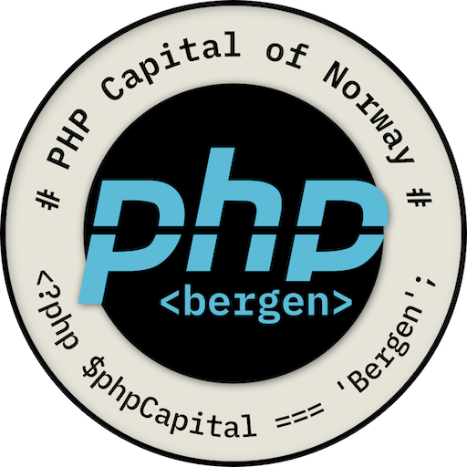

#  PHP pipe operator

* [The basics](basics.md)
* [Useful knowledge](useful-knowledge.md)
* [More on use](more-use.md)
* [Mot always the solution](avoid.md)
* [PHP 8.6](php-8.6.md)

## [> Home](../README.md)
